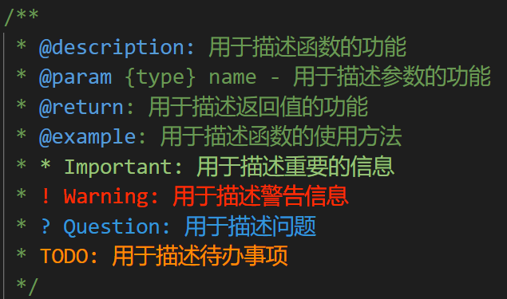

# 编程规范

- [编程规范（代码规范）](http://www.codebaoku.com/specification/specification-index.html)
- [Google C++ Style Guide](https://google.github.io/styleguide/cppguide.html)
- [15 Ways to Write Beautiful Code](https://dzone.com/articles/15-ways-to-write-beautiful-code)

## 硬件与逻辑分离

用宏描述行为

```c
#define LED_ON          1
#define turnOnLED(led)  SetBit(led, LED_ON)
```

---

逻辑一致

0 是关闭, 熄灭, 1 是打开, 点亮

## 可读性

- 将任务分解为直观的基本步骤

- 如果晦涩, 然后将晦涩的操作封装为函数

---

example = 流水灯

需要一位一位地点亮灯, 直观的想法是希望有一个函数

```c
setBitEx(LED, i, LED_ON);
delay(10000);
setBitEx(LED, i, LED_OFF);
```

## 凸出主逻辑

- main 写在开头, 紧接着是主体逻辑

> 追求一定的代码密度

## 文档先行

在 docs 当中描述自己的需求, 给出解决方法, 最后再敲代码

> think twice, code once

## 美观

对齐, 如同一一映射

```c
#define set(var, res)           ((var) = (res))
#define setChar(var, res)       set(var, (u8)(res))
#define clsBit(var, bit)        set(var, (var) & (~(1 << (bit))))
#define setBit(var, bit)        set(var, (var) | (1 << (bit)))
#define setBitEx(var, bit, res) setChar(var, clsBit(var, bit) | ((res) << (bit)))
#define get(var)                (var)
```

## 语言适应思考

```c
set(CHOOSE_A, 0);
set(CHOOSE_B, 0);
set(CHOOSE_C, 1);
```

思考上更习惯横着写

```c
#define setABC(a, b, c) \
  set(CHOOSE_A, a);     \
  set(CHOOSE_B, b);     \
  set(CHOOSE_C, c)

setABC(0, 0, 1);
```

001 对应着 ABC 赋值

## better comment

使用 VSCode 插件, _better comment_

```c
/**
 * @description: 用于描述函数的功能
 * @param {type} name - 用于描述参数的功能
 * @return: 用于描述返回值的功能
 * @example: 用于描述函数的使用方法
 * * Important: 用于描述重要的信息
 * ! Warning: 用于描述警告信息
 * ? Question: 用于描述问题
 * TODO: 用于描述待办事项
 */
```



## 变量名

一般采用 camel 形式

如果有全局变量, 则可以采用类似面向对象的方式

`int0_init`: int0, 代表一个对象 interrupt 0, init 代表对象的方法
