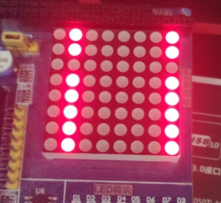
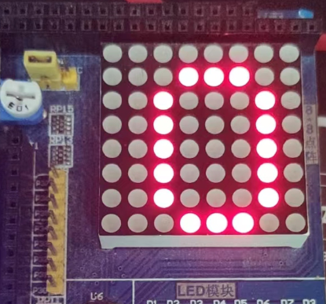
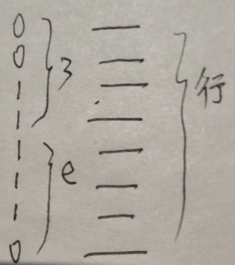

# rethink

## 观察与思考



如图的一个现象, 我认为是两列点亮, 然后有一行熄灭. 我是这么观察的

`0x41`: 代表了两列点亮, 也就是 `0100 0001`

`~0x01`: 代表了一行熄灭, 也就是 `1111 1110`

这样的观察作用于我的思考, 于是我构造了相应的函数

- `setLEDMatrixCol`: 设置列, 两列点亮
- `setLEDMatrixRow`: 设置行, 一行熄灭

```c
#define setLEDMatrixRow       sendByte74HC595
#define setLEDMatrixCol(ch)   set(P0, ~ch)

void main() {
  setLEDMatrixCol(0x41);
  u8 rowShape = (u8)~0x01;
  while (1) {
    setLEDMatrixRow(rowShape);
    rowShape = RLC(rowShape, 1);
    delay(10000);
  }
}
```

- 详细代码<a class="Repos" target="_blank" href="./07-IO-74HC595.c">07-IO-74HC595</a>

然后在为了实现下面效果的时候



根据上面的思考, 我写了下面的代码

> 先前的观察与表述影响了我的思考

```c
#define setLEDMatrixRow       sendByte74HC595
#define setLEDMatrixCol(ch)   set(P0, ~ch)

u8 rowShape[] = {0x00, 0x00, 0x3e, 0x41, 0x41, 0x41, 0x3e, 0x00}; // 位选数据
u8 colShape[] = {1<<7, 1<<6, 1<<5, 1<<4, 1<<3, 1<<2, 1<<1, 1<<0}; // 段选数据

void main() {

  while (1) {
    setLEDMatrixCol(0x7f);
    for (int i = 0; i < 8; i++) {
      setLEDMatrixCol(colShape[i]);
      setLEDMatrixRow(rowShape[i]);
      delay(100);
      setLEDMatrixRow(0x00);         // 消隐
    }
  }
}
```

- 详细代码<a class="Repos" target="_blank" href="./08-LED-Matrix.c">08-LED-Matrix</a>

这非常奇怪`0x00, 0x00, 0x3e`这些明明是一列一列观看地, 却写到了 rowShape 里面

仔细思考确实如此, 取出 0x3e 观察, 这是第三列, 而 0x3e 表达的是每一行开与关



!> 这个关系有点绕

重新思考后, 我发现 row, col 针对的是坐标点, 而这里应该来说是向量. 有了列向量, 就不应该有 row 这样的东西, 使用下标代替 row 更好

重新描述:

`sendByte74HC595`是用来构造列向量的, 可以想象有一个全局的向量

```c
sendByte74HC595(0x3e);
```

表达了构造一个 0x3e 的全局的列向量

```c
P0 = 1 << 7;
```

表达了将全局的向量填补到 LED 矩阵的第 7 列

将代码重构了, 如下

```c
#define createVector          sendByte74HC595
#define clearVector()         createVector(0x00)
#define copyVectorTo(index)   set(P0, ~(index))

void delay(u16 i);

u8 vecs[] = {0x00, 0x00, 0x3e, 0x41, 0x41, 0x41, 0x3e, 0x00}; // 向量组

void main() {

  while (1) {
    for (int i = 0; i < 8; i++) {
      copyVectorTo(1 << i);
      createVector(vecs[i]);
      delay(100);
      clearVector();  // 消隐
    }
  }
}
```

同时, 这良好地表达了位选与段选. `copyVectorTo` 是位选, 速度快, 而 `createVector` 比较费力, 是段选

## 偏见

过分看重了软件设计, 轻视了硬件的学习与思考.

在进行 uart 的重构的时候, 发现不断发送 hello, 会有一些字符丢失. 自信认为软件设计没有问题, 觉得是硬件问题. 于是, 没有多想, 直接将代码提交了. 可是 @yong580 不那么认为, 觉得硬件没有问题, 因为没有硬件理由出现这个问题. 他提出问题: 为什么会这样呢? 并且让我回退之前一个斑纹的代码, 看看是不是硬件的问题.

回退重构之前的代码, 没有问题, 说明硬件没有问题. 不言而喻, 中断的软件设计有问题. 于是我们很快排查出问题, 中断处理的时候, 由于发送数据与接受数据共用一个中断, 会有冲突.

详细见[UART](/experiment/13-uart/README.md#issue)

感谢 @yong580 提出的问题.

在这个问题的处理上面, 我过分强调了软件的设计, 忽略了逻辑的正确性. 同时, 我感受到了自己的懒惰, 根本没有尝试着去思考和解决这个问题, 以硬件理由来回避.
