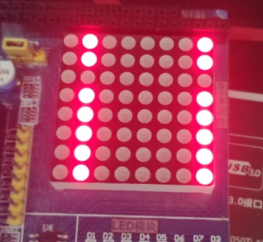
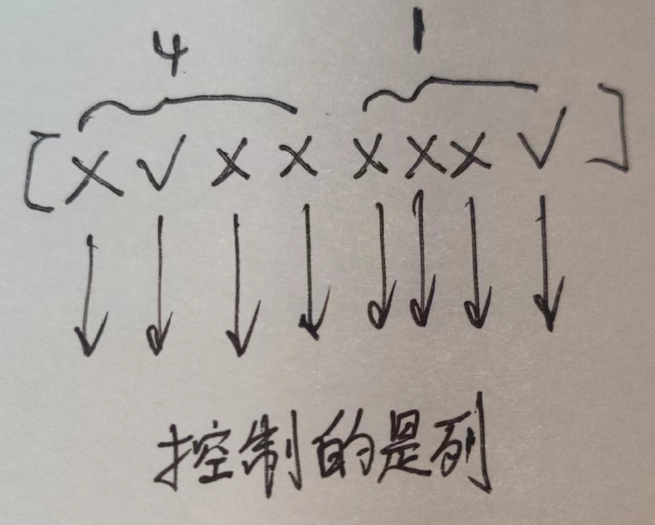
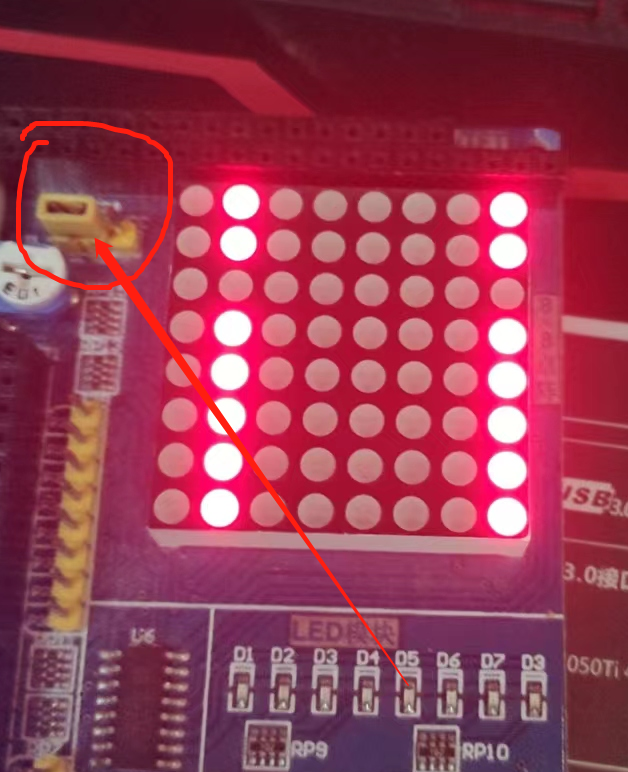
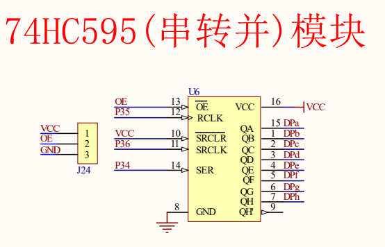

# IO 扩展

74HC595: 8-BIT SHIFT REGISTER WITH 8-BIT OUTPUT REGISTER

> 详细功能查看手册的`Device Functional Modes`部分

## task

用 IO 扩展模块, 操作 8X8 点阵实现流水灯

一位一位地将数据移入到 74HC595 中, 然后锁存

## effect



## 分析



行向量控制 led 列

---


列向量控制 led 行

## manual

- [74HC595 instruments](https://www.ti.com/lit/ds/symlink/sn74hc595.pdf?ts=1663727421518&ref_url=https%253A%252F%252Fwww.google.com%252F)

  > 关注以下两个部分

  - Timing Diagram
  - Device Functional Modes

- `SER`: 串口, 存放 0, 1
- `SRCLK`: SR(shift register)时钟, 上升沿将`SER`的数据放入 shift register
- `RCLK`: R(register)时钟, 高电平将 shift register 的数据放入 storage register, 即锁存, 输出

## issue

!> 跳线帽问题

注意跳线帽放对



---

delay

```c
#define DELAY() \
  __asm         \
    nop;        \
    nop;        \
  __endasm
```

在 [sdcc manual](https://sdcc.sourceforge.net/doc/sdccman.pdf) 搜索 nop 得到的

!> 需要分号`;`, 书中没有写分号`;`

## further



可以轻松扩展为 16 位, 通过$Q_{H'}$, 接到下一个 SER

控制线都可以共用

## resources

- <a class="Repos" target="_blank" href="main.c">code</a>
- [74HC595 instruments](https://www.ti.com/lit/ds/symlink/sn74hc595.pdf?ts=1663727421518&ref_url=https%253A%252F%252Fwww.google.com%252F)
