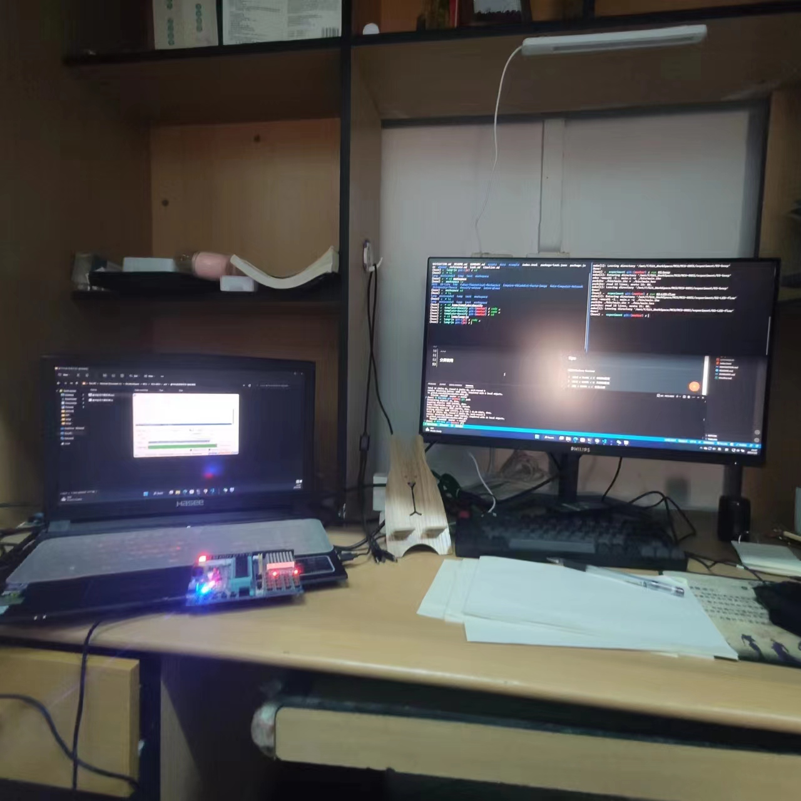

# 实例程序

## usage

## preparation

进入到当前目录`experiment/`

```bash
source ./command
```

!> 是`experiment/command.sh`

## build

```bash
run <path>
```

当前目录会生成一个`bin/`目录, 里面有`hex`文件

## markdown

编写项目下面的 markdown

输入`@template`会自动补全模板

## code

- google c style

  采用 VSCode 插件, 选择`google` format 方式

具体见 [code style](/docs/code-style.md)

## tips

使用 Windows Terminal

- `Ctrl + Shift + T` 新建标签页
- `Ctrl + Shift + W` 关闭标签页
- `Alt + Shift + =` 竖直分屏
- `Ctrl + Tab` 切换标签页

可以分屏窗口来执行烧录程序

---

分屏使用



|                      左边                       |      右边      |
| :---------------------------------------------: | :------------: |
| 点击烧录即可, hex 文件会被覆盖, 不需要重新选择. | 编译和编写代码 |
